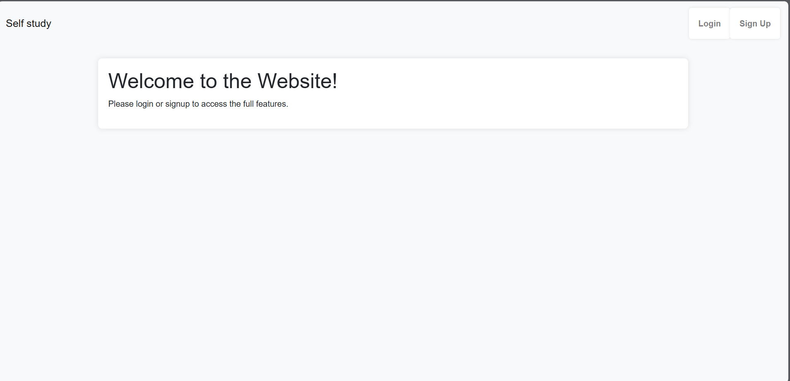
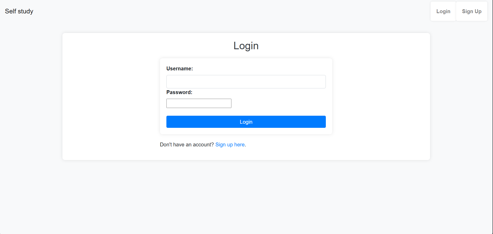
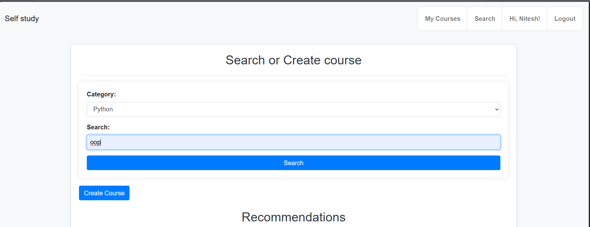
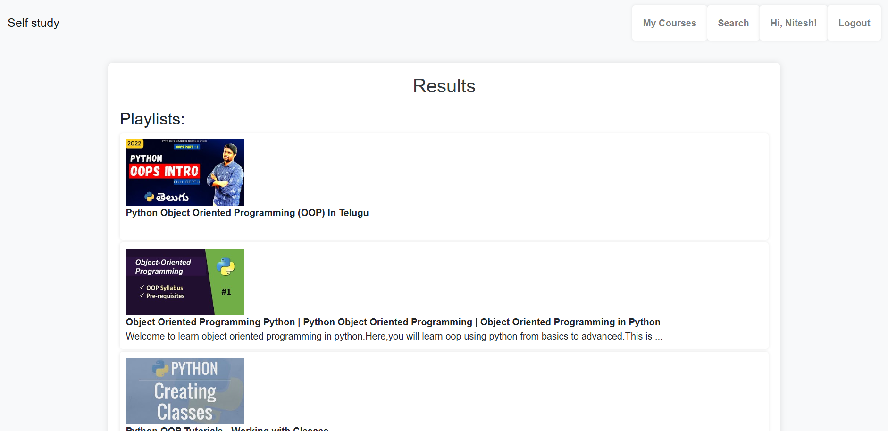
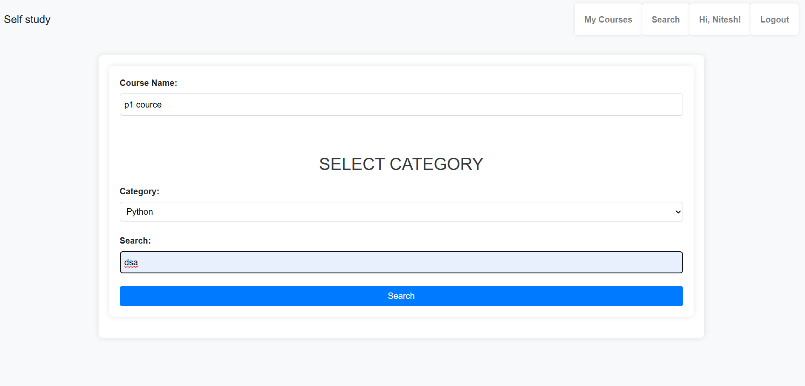
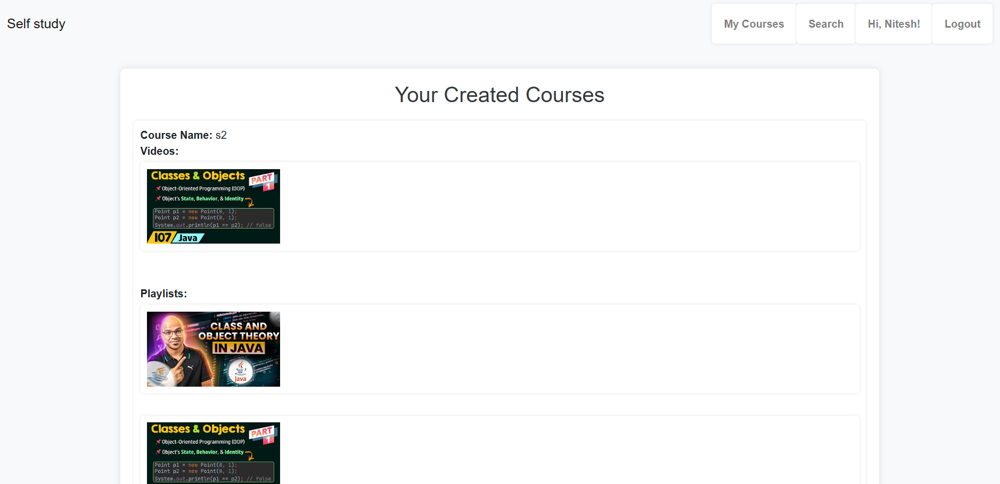
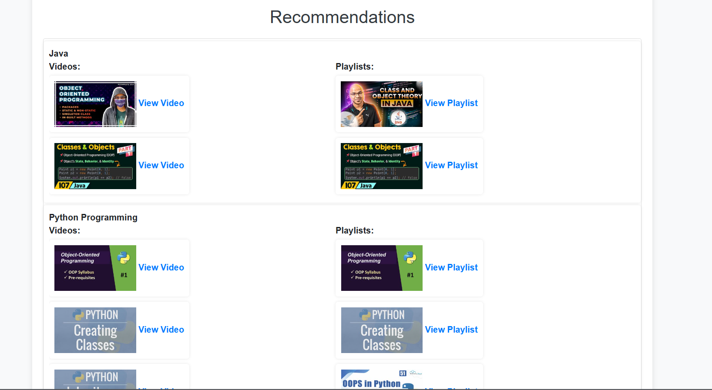
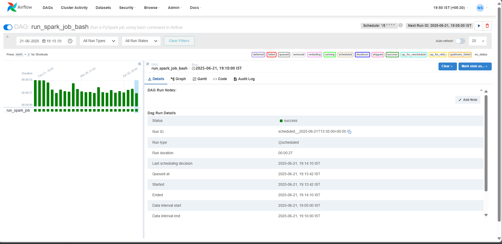

#  KnowEdge
## 📚 Custom Course Recommender using YouTube, PySpark & Django
A full-stack data engineering project where users can create custom courses using YouTube videos and playlists. The system tracks user activity and provides personalized recommendations using a PySpark-based ALS model. Additionally, when a user watches a video, the system generates relevant practice questions using the ChatGPT API to reinforce learning. The application is built with Django, PySpark, Airflow, PostgreSQL, and Docker.

# 🚀 Features
🔍 Search YouTube videos/playlists

➕ Create custom courses from videos

📊 Track video/course engagement

🧠 Get topic-based practice questions for each video using ChatGPT API

🤖 Generate recommendations using PySpark ALS

⏰ Schedule model training using Apache Airflow

🐘 Store data in PostgreSQL

🐳 Run environment with Docker Compose

# 🧰 Tech Stack

| Category         | Tools Used                    |
|------------------|-------------------------------|
| Backend          | Django, REST APIs             |
| Frontend         | HTML                          |
| Database         | PostgreSQL                    |
| Data Processing  | PySpark (ALS Model)           |
| Workflow         | Apache Airflow                |
| Containerization | Docker, Docker Compose        |

# 🤖 Recommendation Pipeline

User activity is saved in PostgreSQL.

Airflow schedules run of PySpark ALS script.

PySpark reads activity data, trains ALS model, and stores recommendations.

Django fetches and displays recommendations per user.

# 💬 Practice Question Generation

When a user watches a YouTube video, its title is sent to the OpenAI ChatGPT API.The API responds with a set of 10 detailed practice questions and short answers related to the video topic.

✅ Based only on the video title (no transcript used)

✅ Stored in PostgreSQL and shown on the video page

✅ Fast response time with real-time display

## 🖼 Step-by-Step Screenshots

### 1️⃣ Home Page (Before Login)
Public landing page with intro text and search bar.  

---

### 2️⃣ Login Page
User login form for accessing personalized features.  

---

### 3️⃣ Home Page (After Login)
User dashboard with access to playlists, custom courses, and recommendations.  

---

### 4️⃣ Search Results
Search results displaying relevant YouTube playlists and videos.  

---

### 5️⃣ Create Course Page
Select videos and playlists to form a custom course.  

---

### 6️⃣ Course Details Page
View the videos inside a custom course.  

---

### 7️⃣ Recommendations Page
Recommended courses and videos based on user activity.  

---

### 8️⃣ Practice Questions Page
Auto-generated topic-based questions using ChatGPT API.  

---

### 9️⃣ Airflow DAG View
Airflow UI showing the daily recommendation training DAG.  

# 🧠 About Me

I’m Nitesh Shinde, a final-year Computer Science (AIML) student passionate about Data Engineering.

🔗 [LinkedIn](https://www.linkedin.com/in/nitesh-shinde-04ba482b4/)

💼 [GitHub](https://github.com/Niteshshinde999/)
